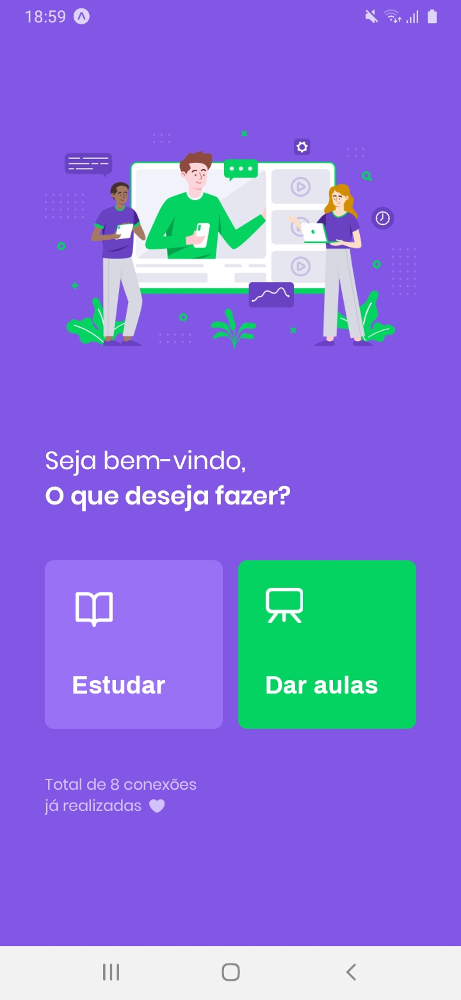
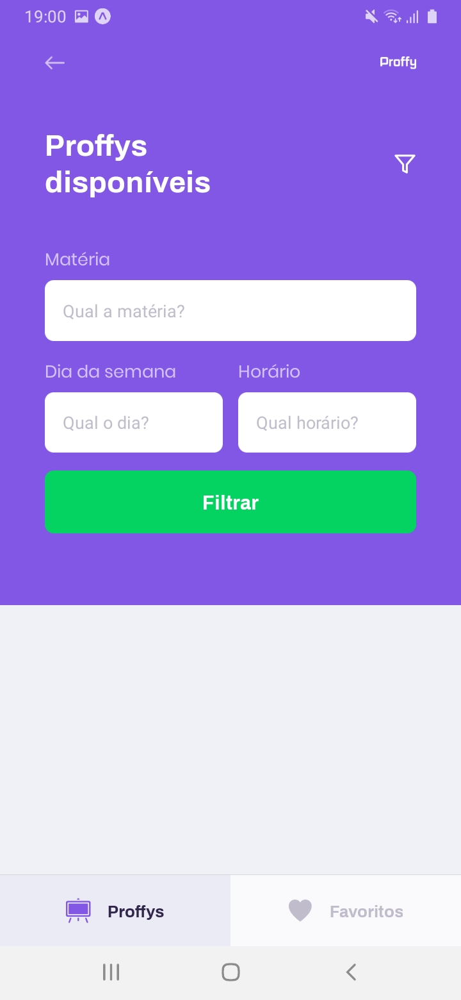

# rocketseat-nlw-02
Projeto contruído durante o Next Level Week #02

# Descritivo
Trata de uma solução (Proffy), que é uma plataforma de estudos, onde alunos e professores poderão se encontrar, aprender e ensinar. Foi construído um site responsivo utilizando o conceito de Mobile First, para depois se adaptar a tela do computador. Já a versão Mobile possibilita que os alunos encontrem os professores cadastrados na plataforma Web.

# backend
Desenvolvido em NodeJS

**(Para testar) yarn start
(http://localhost:3333)

## screenshots

# web
Desenvolvido em ReactJS

**(Para testar) yarn start
(http://localhost:3000)

## screenshots

# mobile
Desenvolvido em React Native

**(Para testar: Expo) yarn start

## screenshots

### Tecnologias e Bibliotecas utilizadas
• TypeScript

• Knex

• SQLite

• CORS

• Express

• React-Icons (Feather Icons)

• React-Router-DOM

• Axios

• Expo

• Expo-Google-Fonts

• React-Navigation (Stack/Tabs)

• React-Native-Gesture-Handler

• React-Native-Reanimated

• React-Native-Screens

• React-Native-Safe-Area-Context

• React-Native-Picker-Select

• Async Storage
