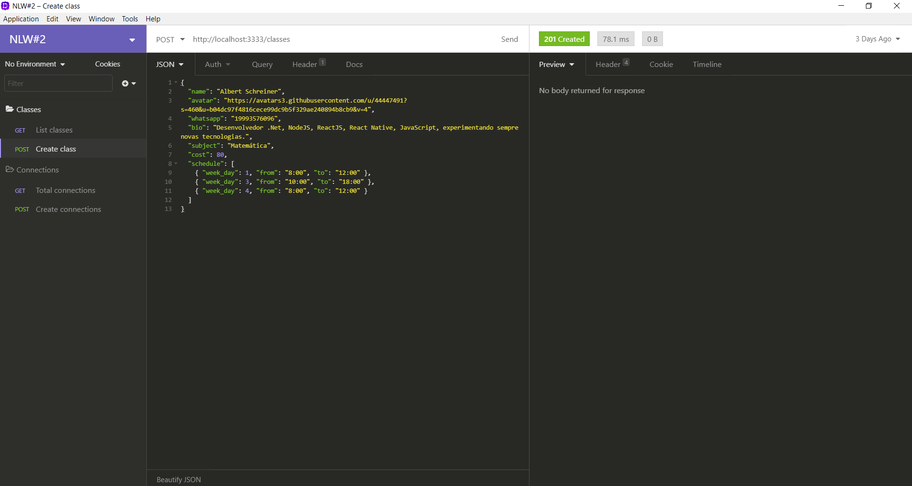
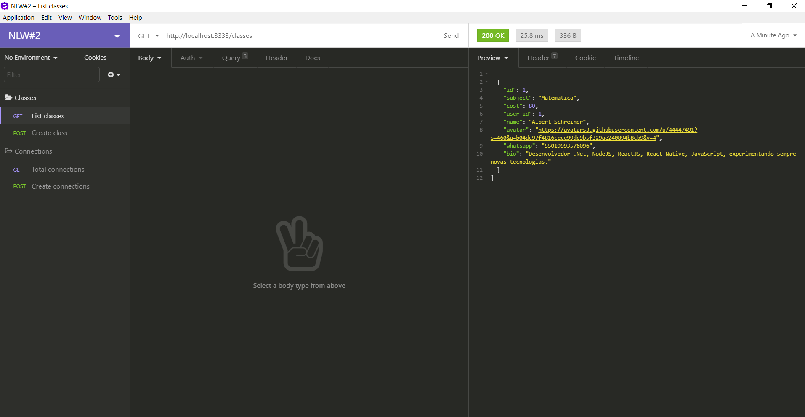
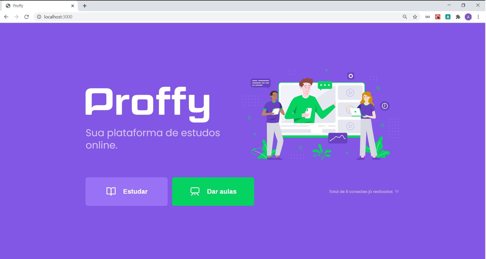
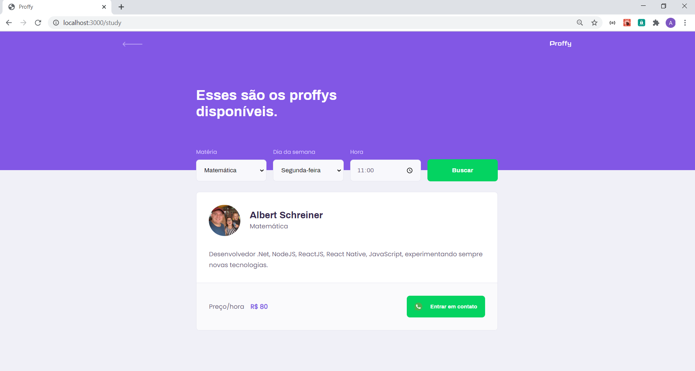
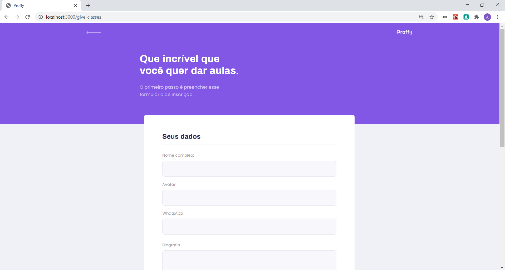
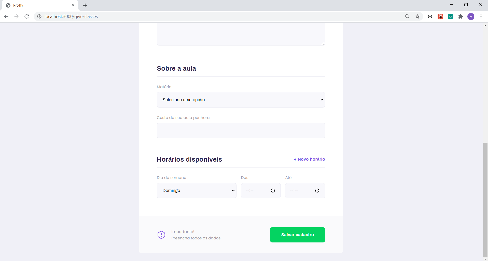

# rocketseat-nlw-02
Projeto contruído durante o Next Level Week #02

# Descritivo
Trata de uma solução (Ecoleta) que é feito através de uma página Web o cadastro de pontos de coleta de resíduos e seus respectivos items. Também contempla um app Mobile onde se é informado no mapa pontos previamente cadastrados e que estejam próximos do local de acesso do app.

# backend
Desenvolvido em NodeJS

**(Para testar) yarn start
(http://localhost:3333)

## screenshots

# web
Desenvolvido em ReactJS

**(Para testar) yarn start
(http://localhost:3000)

## screenshots

# mobile
Desenvolvido em React Native

**(Para testar: Expo) yarn start

## screenshots

### Tecnologias e Bibliotecas utilizadas
• TypeScript

• Knex

• SQLite

• CORS

• Express

• React-Icons (Feather Icons)

• React-Router-DOM

• Axios

• Expo

• Expo-Google-Fonts

• React-Navigation (Stack/Tabs)

• React-Native-Gesture-Handler

• React-Native-Reanimated

• React-Native-Screens

• React-Native-Safe-Area-Context

• React-Native-Picker-Select

• Async Storage
